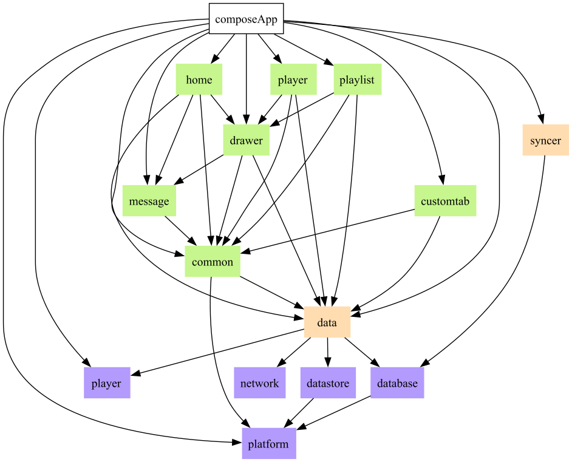

# 贡献代码

欢迎提交PR参与开发， 本文档是有关环境配置和项目架构的说明。

## 环境配置

推荐使用Android Studio。

安装JDK要求17或21

安装SDK要求35以上

## 构建项目与打包

### 运行Android

项目根目录下执行 `./gradlew assembleDebug`

### 运行Desktop
项目根目录下执行 `./gradlew composeApp:run`

### Android App打包
本地不支持打Android Release包， 需要在`master`分支上打TAG，触发Github Actions自动打包

### Desktop App打包
研究中。。。。

## 项目架构

### KMP工程结构
项目采用Kotlin Multiplatform, 每一个Module下的src文件夹下的结构如下：

`commonMain` 平台无关的共同代码。

`jvmMain` 可以使用Java SDK以及JVM平台的库。

`androidMain` 可以使用Android SDK以及Android平台的库。

`desktopMain` 可以使用Java SDK以及Desktop平台的库。

commonMain中的代码可以在所有平台上共享，
jvmMain可以在android端和desktop端共享。

### 项目架构

 - `composeApp` 应用入口
 - `:core:data` 数据层， 负责给UI层提供数据， 接受UI层的操作Event
 - `:core:syncer` 扫描媒体库并同步数据库
 - `:core:platform` 提供平台相关的信息
 - `:core:database` 数据库相关， 使用了Room
 - `:core:network` 网络相关， 使用了Ktor Client
 - `:core:player` 播放器相关， Android侧使用了ExoPlayer， Desktop目前没实装
 - `:core:datastore` 存储用户设置，使用了DataStore。
 - `:feature:common` 通用的UI组件, 主题颜色等
 - `:feature:**` 具体的功能模块 

