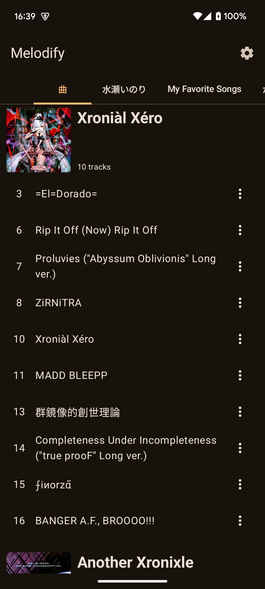
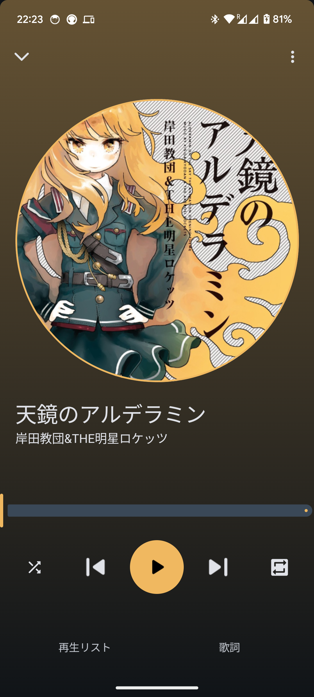
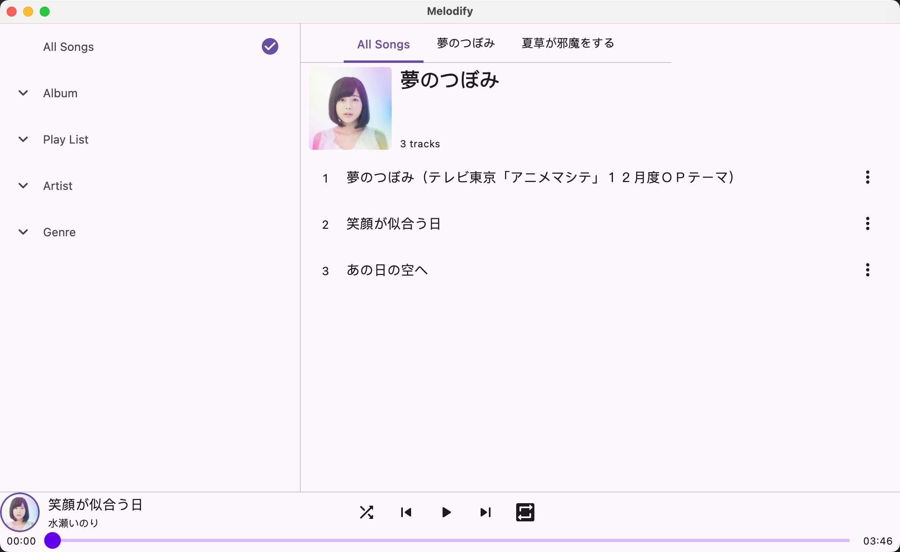

# Melodify
Melodify is designed for playing local music and is built using Compose Multiplatform.
It's currently in the early stages of development, so feel free to report any issues or suggestions.

## Android
Retrieve content from MediaStore and play music using Media3.

  
  
  

## Desktop App
Scan music files from the local directory and play using VLC.
Development is progressing at a very slow pace.

## iOS
Not yet implemented.

### Code style
running `./gradlew ktLintCheck` to check lint issues

running `./gradlew ktLintFormat` to automatically fix lint errors.

running `./gradlew spotlessCheck` to check copyright.

running `./gradlew spotlessApply` to add copyright.

### Testing

1. Run `./gradlew connectedDebugAndroidTest` to execute android instrument tests.
2. Run `./gradlew iosSimulatorArm64Test` to execute iOS tests.
